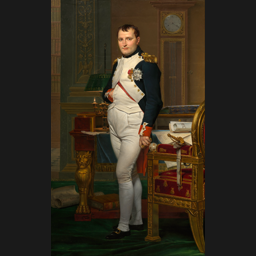
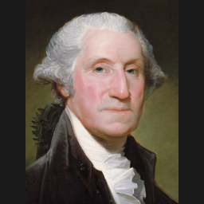

# 🧠 Legendary Leaders AI

**Legendary Leaders AI** is a standalone Age of Empires III: Definitive Edition mod that combines the base civilizations with the playable revolution roster. Each nation is mapped to a themed leader personality and a clear battlefield identity.

*French note:* **Revolutionary France and Napoleonic France now use separate selectable civs.** Royal France remains the base French civ, while the two revolution-era French paths now have their own nation slots and card pools.

## 🏳️ Surrender

Surrender is currently an *AI-driven battlefield mechanic*, not a player button: damaged non-elite units can give up when elite support is gone, and they then move into the existing prison flow instead of instantly switching sides. If we add a proper surrender button later, the clean implementation is a dedicated tech or UI command that calls this same prison-transfer logic rather than creating a second surrender system.

## 🌍 Nation Guide

Portraits below match the current in-game nation portraits used by the mod. Flags are shown with small real-world flag markers for quick reading.

<strong>Standard Nations (22)</strong>

| Portrait | Flag | Nation | Leader | Playstyle |
| --- | --- | --- | --- | --- |
|  | 🇲🇽 | Aztecs | Montezuma II | *Aggressive* imperial warbands with fast infantry pressure and coyote mobility. |
|  | 🇬🇧 | British | Duke of Wellington | *Defensive* manor-and-musketeer play with reliable artillery scaling. |
|  | 🇨🇳 | Chinese | Kangxi Emperor | *Balanced* banner-army macro with layered armies and steady siege support. |
|  | 🇳🇱 | Dutch | Maurice of Nassau | *Defensive* bank economy with skirmisher-ruyter control. |
|  | 🇪🇹 | Ethiopians | Menelik II | *Aggressive* modernization with strong infantry pressure and artillery follow-through. |
|  | 🇫🇷 | French | Napoleon Bonaparte | *Aggressive* imperial tempo with skirmisher-cuirassier power spikes. |
|  | 🇩🇪 | Germans | Frederick the Great | *Balanced* cavalry-mercenary warfare with strong timing pushes. |
|  | 🇨🇦 | Haudenosaunee | Hiawatha | *Balanced* confederacy warfare with early warband mass and siege pressure. |
|  | 🇳🇬 | Hausa | Usman dan Fodio | *Aggressive* influence-backed expansion with mobile raids. |
|  | 🇵🇪 | Inca | Pachacuti | *Defensive* mountain empire with dense infantry and attritional control. |
|  | 🇮🇳 | Indians | Shivaji Maharaj | *Balanced* flexibility with strong infantry cores and sharp transitions. |
|  | 🇮🇹 | Italians | Giuseppe Garibaldi | *Balanced* architect-command economy with flexible infantry-artillery play. |
|  | 🇯🇵 | Japanese | Tokugawa Ieyasu | *Defensive* shrine economy with disciplined timing windows. |
|  | 🇺🇸 | Lakota | Crazy Horse | *Aggressive* mounted mobility with constant raiding and map control. |
|  | 🇲🇹 | Maltese | Jean Parisot de Valette | *Defensive* fortress play with emplacements and stubborn infantry anchors. |
|  | 🇲🇽 | Mexicans | Miguel Hidalgo y Costilla | *Balanced* insurgent republic with adaptable armies and civic tempo. |
|  | 🇹🇷 | Ottomans | Suleiman the Magnificent | *Aggressive* gunpowder tempo with Janissary pressure and artillery spikes. |
|  | 🇵🇹 | Portuguese | Prince Henry the Navigator | *Defensive* town-center boom with strong ranged cores. |
|  | 🇷🇺 | Russians | Catherine the Great | *Aggressive* mass-army play with cheap infantry floods and blockhouse pressure. |
|  | 🇪🇸 | Spanish | Isabella I of Castile | *Aggressive* shipment-led conquest with fast timing attacks. |
|  | 🇸🇪 | Swedes | Gustavus Adolphus | *Aggressive* torp-and-timing warfare with Carolean mass. |
|  | 🇺🇸 | United States | George Washington | *Balanced* republican flexibility with broad card options and steady scaling. |

<strong>Revolution Nations (26)</strong>

| Portrait | Flag | Nation | Leader | Playstyle |
| --- | --- | --- | --- | --- |
|  | 🇺🇸 | Americans | Thomas Jefferson | *Balanced* statesman-general play with flexible infantry and measured artillery scaling. |
|  | 🇦🇷 | Argentines | Jose de San Martin | *Aggressive* liberation cavalry with fast campaigning and mobile strikes. |
|  | 🇲🇽 | Baja Californians | Juan Bautista Alvarado | *Aggressive* frontier raiding with cavalry-heavy harassment. |
|  | 🇱🇾 | Barbary | Hayreddin Barbarossa | *Aggressive* corsair warfare with trade disruption and raids. |
|  | 🇧🇷 | Brazil | Pedro I of Brazil | *Balanced* imperial combined arms with reliable artillery support. |
|  | 🇺🇸 | Californians | Mariano Guadalupe Vallejo | *Defensive* frontier administration with trade-rich economy and careful cavalry response. |
|  | 🇨🇦 | Canadians | Isaac Brock | *Defensive* frontier line with forts and disciplined infantry-artillery play. |
|  | 🇭🇳 | Central Americans | Francisco Morazan | *Balanced* federalist warfare with native alliances and steady tempo. |
|  | 🇨🇱 | Chileans | Bernardo O'Higgins | *Balanced* republican army with disciplined infantry and fort support. |
|  | 🇨🇴 | Columbians | Simon Bolivar | *Aggressive* liberator combined arms with forward bases and artillery pressure. |
|  | 🇪🇬 | Egyptians | Muhammad Ali Pasha | *Balanced* reformer modernization with strong artillery and infrastructure. |
|  | 🇫🇮 | Finnish | Carl Gustaf Emil Mannerheim | *Defensive* marshal doctrine with entrenched infantry-artillery play. |
|  | 🇨🇦 | French Canadians | Louis-Joseph Papineau | *Defensive* militia-reformer style with civic endurance and trade resilience. |
|  | 🇭🇹 | Haitians | Toussaint Louverture | *Aggressive* revolutionary infantry with native-backed land pressure. |
|  | 🇭🇺 | Hungarians | Lajos Kossuth | *Aggressive* nationalist combined arms with strong cavalry commitment. |
|  | 🇮🇩 | Indonesians | Prince Diponegoro | *Defensive* resistance warfare with patient trade-backed play. |
|  | 🇲🇽 | Mayans | Jacinto Canek | *Aggressive* indigenous uprising with infantry and native swarms. |
|  | 🇲🇽 | Mexicans (Revolution) | Jose Maria Morelos | *Aggressive* insurgent offense with infantry-led attacks and rising momentum. |
|  | 🇫🇷 | Revolutionary France | Maximilien Robespierre | *Aggressive* republican terror-state play with zeal, militia pressure, and anti-elite momentum. |
|  | 🇫🇷 | Napoleonic France | Napoleon Bonaparte | *Aggressive* imperial tempo with heavy artillery, cavalry support, and forward-base escalation. |
|  | 🇵🇪 | Peruvians | Andres de Santa Cruz | *Defensive* Andean marshal play with infantry lines and fort-backed control. |
|  | 🇲🇽 | Rio Grande | Antonio Canales Rosillo | *Aggressive* border-war mobility with fast cavalry raids. |
|  | 🇷🇴 | Romanians | Alexandru Ioan Cuza | *Defensive* reformist combined arms with organized infantry-artillery pressure. |
|  | 🇿🇦 | South Africans | Paul Kruger | *Defensive* frontier command with trade leverage and stubborn strongpoints. |
|  | 🇺🇸 | Texians | Sam Houston | *Defensive* frontier counterpunch with fortified positions. |
|  | 🇲🇽 | Yucatan | Felipe Carrillo Puerto | *Balanced* regional resistance with native support and stubborn territorial play. |

