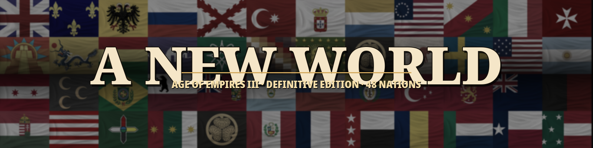

<p align="center">
	
</p>

<p align="center">
	<a href="https://github.com/jflessenkemper/AOE-3-DE-A-New-World-DLC/actions/workflows/validation-suite.yml"></a>
	<a href="https://jflessenkemper.github.io/AOE-3-DE-A-New-World-DLC/"></a>
</p>

**A New World** is a standalone Age of Empires III: Definitive Edition mod that fuses the 22 base civilizations with all 26 playable revolutions into a single 48-nation roster. Every nation gets a historically-accurate leader, a hand-curated 25-card deck, a per-leader AI doctrine, and a real map-placement bias the AI actually obeys.

## ✨ Features

- **48 distinct civilizations** — 22 base civs + 26 revolution-era civs promoted to top-level pickable nations (Napoleon, Revolutionary France, Americans, Chileans, Texians, Finns, Barbary, Haitians, Yucatec…).
- **Lobby-matched leader portraits, names, and chat quotes** — Queen Elizabeth I for British, Ivan the Terrible for Russians, Chief Gall for Lakota, Napoleon for Napoleonic France. Consistent from lobby thumbnail to in-match scoreboard.
- **Per-leader AI doctrine** — distinct build orders, military comps, and explorer-escort posture authored in XS for every nation.
- **Curated 25-card "A New World" deck per civ** — matched to each leader's playstyle (aggressive / defensive / economic / naval).
- **Historical map placement** — every civ pinned to a terrain (Coast, River, Highland, Plain, Wetland, DesertOasis, Jungle, ForestEdge) and an expansion heading (AlongCoast, Upriver, FrontierPush, IslandHop, OutwardRings…) that biases real `cBuildPlanCenterPosition` placement, not just labels. British settle the coast, Russians push upriver, Lakota fan onto the plains, Maltese dig in on the highland.
- **Leader-escort doctrine** — the AI treats its explorer as the battlefield leader, with a living screen of units around them. Some nations win by crushing the line; others look for a leader-kill opening.
- **Smart rout** — only AI non-elite land units rout (≤25% HP, no friendly elite nearby); elites and player-controlled units never auto-rout.
- **Revolutions disabled on base civs** — the 26 revolution nations are already top-level picks, so age-up doesn't offer the old options.
- **[Reference site](https://jflessenkemper.github.io/AOE-3-DE-A-New-World-DLC/)** — every nation has a Playstyle panel covering build shape, age-by-age strategy, combat doctrine, military comp, eco posture, and defensive layer.

## 📦 Install

1. Download the latest zip from [Releases](https://github.com/jflessenkemper/AOE-3-DE-A-New-World-DLC/releases) (or subscribe on Steam Workshop once live).
2. Extract into your local mods folder:
   - **Windows:** `%USERPROFILE%\Games\Age of Empires 3 DE\<steamID>\mods\local\AOE 3 DE - A New World DLC\`
   - **Linux/Proton:** `~/.local/share/Steam/steamapps/compatdata/933110/pfx/drive_c/users/steamuser/Games/Age of Empires 3 DE/<steamID>/mods/local/AOE 3 DE - A New World DLC/`
3. Launch AoE3 DE → **Tools → Mods**, enable **AOE 3 DE - A New World DLC**, restart, and pick any civ in Skirmish or Multiplayer.

> Multiplayer is host-only — every player should run the same version to avoid desyncs.

## ⚠️ Cosmetic limits (engine-side)

- **Deck Builder** for base civs still shows the stock decks (Beginner/Land/Naval/Tycoon/Treaty); revolution civs correctly show the A New World deck.
- **"MY DECK"** label is hard-coded in the binary savegame; the 25-card content inside is ours.

## 🛠️ Development

```sh
tools/test.sh --no-packaged   # fast local sweep (validators + unit tests)
tools/test.sh                 # full sweep (matches CI)
```

See [`docs/testing-harness.md`](docs/testing-harness.md) for the full validator inventory and how to add new checks.

## 📤 Publishing (maintainers)

In-game: **Tools → Mods → Mod Manager** → select the mod → **Publish** (or **Update Existing**). Bump `version` in `modinfo.json` between updates so subscribers pick it up automatically. Workshop thumbnail: `resources/images/a_new_world_banner.png`.
