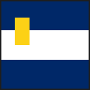
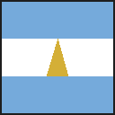
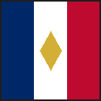

# Legendary Leaders AI

Legendary Leaders AI is a standalone Age of Empires III: Definitive Edition mod that combines the base civilizations with the fully playable revolution roster. Every nation is mapped to a themed leader personality, a defined AI playstyle, and custom quote sets.

## Surrender Mechanic

- Surrender is currently an AI battlefield mechanic, not a player command button.
- Standard military units can only surrender after they have taken serious damage.
- Elite units never surrender.
- Standard units also refuse surrender if elite support is still nearby.
- Surrendering units head toward enemy-controlled prison or anchor areas instead of instantly changing ownership.
- The prison system also handles guard behavior, rescue alerts, and naval prison protection.

## Nation Guide

Portraits below match the current in-game nation portraits used by the mod.
Standard nations list their normal in-game flag set by name. Revolution nations below now show the installed revolution flag art pulled from the local mod files.

Standard Nations (22)

| Portrait | Flag Used | Nation | Leader | Playstyle | Quote 1 | Quote 2 |
| --- | --- | --- | --- | --- | --- | --- |
|  | Aztec | Aztecs | Montezuma II | Aggressive imperial warbands. Fast infantry pressure, coyote mobility, and momentum through battlefield control. | "You arrive with noise, not destiny." | "You fought with worthy ferocity." |
|  | British | British | Duke of Wellington | Defensive line-and-manor empire. Reliable musketeer-dragon cores, safe economy, and late artillery weight. | "Your line lacks discipline and purpose." | "A respectable stand, for once." |
|  | Chinese | Chinese | Kangxi Emperor | Balanced banner-army macro. Efficient populations, layered armies, and steady artillery-supported pushes. | "You rule without harmony and fight without measure." | "That was a measured response." |
|  | Dutch | Dutch | Maurice of Nassau | Defensive bank economy. Skirmisher-ruyter control, trade stability, and disciplined artillery scaling. | "Your formation collapses before the volley." | "That was executed with uncommon discipline." |
|  | Ethiopian | Ethiopians | Menelik II | Aggressive modernizing empire. Strong infantry pressure, mountain resilience, and artillery-backed pushes into midgame. | "You overreach without foundations." | "You held together well under pressure." |
|  | French | French | Napoleon Bonaparte | Aggressive imperial tempo. Skirmisher-cuirassier power, artillery spikes, and relentless forward-base escalation. | "You maneuver like a clerk, not a commander." | "At last, a battle worthy of my maps." |
|  | German | Germans | Frederick the Great | Balanced cavalry-mercenary war machine. Uhlan raids, strong timing pushes, and efficient trade-backed scaling. | "Precision has clearly never served under you." | "That was unexpectedly competent." |
|  | Haudenosaunee | Haudenosaunee | Hiawatha | Balanced confederacy warfare. Early infantry mass, siege pressure, and map control through coordinated warbands. | "You break alliances as easily as you break formations." | "You stood with resolve." |
|  | Hausa | Hausa | Usman dan Fodio | Aggressive caliphate expansion. Mobile raids, influence-backed economies, and disciplined pressure that snowballs quickly. | "Your ambition runs ahead of your discipline." | "You fought with purpose." |
|  | Incan | Inca | Pachacuti | Defensive mountain empire. Dense infantry, fortification depth, and attritional control through long macro games. | "You build without vision and attack without patience." | "You showed endurance." |
|  | Indian | Indians | Shivaji Maharaj | Balanced subcontinental flexibility. Strong infantry cores, adaptive tech routes, and sharp timing transitions. | "You defend slowly and pursue even slower." | "That was an agile response." |
|  | Italian | Italians | Giuseppe Garibaldi | Balanced architect-command economy. Lombard scaling, flexible infantry-artillery play, and opportunistic counterattacks. | "You march like a parade, not an army." | "Good. You still have fire in you." |
|  | Japanese | Japanese | Tokugawa Ieyasu | Defensive shrine-and-discipline empire. Safe economy, tight infantry timing windows, and efficient late scaling. | "You are eager, but eagerness is not strategy." | "That was patient work." |
|  | Lakota | Lakota | Crazy Horse | Aggressive mounted mobility. Constant raiding, wide map control, and pressure that punishes every greedy expansion. | "You are slow enough to be hunted." | "You struck hard." |
|  | Maltese | Maltese | Jean Parisot de Valette | Defensive fortress order. Emplacements, stubborn infantry anchors, and punishing anti-siege resistance. | "You break yourself upon stone and faith." | "You press hard." |
|  | Mexican | Mexicans | Miguel Hidalgo y Costilla | Balanced insurgent republic. Flexible federal scaling, adaptable armies, and tempo driven by civic upgrades and militia pressure. | "Your rule is weaker than the people you ignore." | "You fought with conviction." |
|  | Ottoman | Ottomans | Suleiman the Magnificent | Aggressive gunpowder tempo. Free villager growth, Janissary pressure, and artillery timing spikes that punish passivity. | "Your empire lacks both law and strength." | "That was a firm response." |
|  | Portuguese | Portuguese | Prince Henry the Navigator | Defensive town-center boom. Safe expansion, strong ranged cores, and efficient naval or artillery follow-through. | "Your horizon ends where your courage fails." | "A rare captain." |
|  | Russian | Russians | Catherine the Great | Aggressive mass-army empire. Cheap infantry floods, blockhouse pressure, and constant map-wide reinforcement. | "You mistake size for strength." | "You offered a competent resistance." |
|  | Spanish | Spanish | Isabella I of Castile | Aggressive shipment-led conquest. Fast timing attacks, cavalry-artillery spikes, and pressure powered by home-city tempo. | "You squander heaven's patience along with your troops." | "That was a determined stroke." |
|  | Swedish | Swedes | Gustavus Adolphus | Aggressive torp-and-timing warfare. Carolean mass, leather cannon support, and rapid punishing pushes. | "Your line is too slow for modern war." | "That was a bold response." |
|  | United States | United States | George Washington | Balanced republican flexibility. Broad card options, adaptable unit mixes, and steady timing improvements across ages. | "Liberty is not defended by blundering." | "You stood your ground well." |

Revolution Nations (25)

| Portrait | Flag | Nation | Leader | Playstyle | Quote 1 | Quote 2 |
| --- | --- | --- | --- | --- | --- | --- |
|  |  | Americans | George Washington | Balanced statesman-general. Flexible infantry core, measured artillery scaling, steady tempo. | "Liberty is not defended by blundering." | "You stood your ground well." |
|  |  | Argentines | Jose de San Martin | Aggressive liberation cavalry. Forward pressure, mobile strikes, and fast campaigning. | "The Andes would reject such a timid march." | "You kept your line under pressure." |
|  |  | Baja Californians | Juan Bautista Alvarado | Aggressive frontier raider. Cavalry-heavy harassment with fast border pressure. | "You ride hard and think slowly." | "That was a bold raid." |
|  |  | Barbary | Hayreddin Barbarossa | Aggressive corsair warfare. Mobile cavalry, trade disruption, and raiding momentum. | "You sail and march with equal confusion." | "You struck boldly." |
|  |  | Brazil | Pedro I of Brazil | Balanced imperial combined arms. Artillery-backed armies with reliable trade support. | "You hesitate while nations are born." | "That was a respectable advance." |
|  |  | Californians | Mariano Guadalupe Vallejo | Defensive frontier administration. Trade-rich economy with careful cavalry response. | "You threaten the province more than you command it." | "A careful move." |
|  |  | Canadians | Isaac Brock | Defensive frontier line. Infantry-artillery discipline, forts, and towered holdouts. | "You press a frontier you do not understand." | "That attack had backbone." |
|  |  | Central Americans | Francisco Morazan | Balanced federalist force. Native alliances, controlled tempo, and steady pressure. | "You divide what you are too weak to govern." | "That was a determined stand." |
|  |  | Chileans | Bernardo O'Higgins | Balanced republican army. Disciplined infantry with fort support and resilient defense. | "You attack without endurance." | "You fought stubbornly." |
|  |  | Columbians | Simon Bolivar | Aggressive liberator combined arms. Forward bases, artillery, and constant operational pressure. | "You dream of dominion and cannot hold a ridge." | "A spirited stand." |
|  |  | Egyptians | Muhammad Ali Pasha | Balanced reformer modernization. Strong artillery, solid infrastructure, and fortress support. | "You inherit armies and still waste them." | "You built pressure intelligently." |
|  |  | Finnish | Carl Gustaf Emil Mannerheim | Defensive marshal doctrine. Entrenched infantry-artillery play with strict discipline. | "You squander position as if terrain were free." | "That defense was properly arranged." |
|  |  | French Canadians | Louis-Joseph Papineau | Defensive militia-reformer style. Infantry focus, civic endurance, and trade resilience. | "You govern by habit, not principle." | "You resisted with spirit." |
|  |  | Haitians | Toussaint Louverture | Aggressive revolutionary infantry. High-pressure land fighting with native support. | "Chains and arrogance make poor strategy." | "You resisted with courage." |
|  |  | Hungarians | Lajos Kossuth | Aggressive nationalist combined arms. Cavalry charges, strong tempo, and forward commitment. | "You bow too easily to events." | "That charge had conviction." |
|  |  | Indonesians | Prince Diponegoro | Defensive resistance warfare. Infantry, native support, and patient trade-backed play. | "You mistake occupation for command." | "You moved with patience." |
|  |  | Mayans | Jacinto Canek | Aggressive indigenous uprising. Infantry and native swarms with relentless pressure. | "You mistake domination for permanence." | "You stood longer than I expected." |
|  |  | Mexicans (Revolution) | Miguel Hidalgo y Costilla | Aggressive insurgent offense. Infantry-led attacks, anti-trade bias, and rising momentum. | "Your rule is weaker than the people you ignore." | "You fought with conviction." |
|  |  | Napoleonic France | Napoleon Bonaparte | Aggressive imperial tempo. Heavy artillery, cavalry support, and forward-base escalation. | "You maneuver like a clerk, not a commander." | "At last, a battle worthy of my maps." |
|  |  | Peruvians | Andres de Santa Cruz | Defensive Andean marshal play. Infantry lines, native ties, and fort-backed control. | "Your campaign lacks altitude and vision." | "That was a disciplined push." |
|  |  | Rio Grande | Antonio Canales Rosillo | Aggressive border-war mobility. Fast cavalry raids and opportunistic offense. | "You were too slow for this border." | "That was a quick strike." |
|  |  | Romanians | Alexandru Ioan Cuza | Defensive reformist combined arms. Organized infantry-artillery pressure with strong structure. | "You confuse disorder with freedom." | "You organized that attack well." |
|  |  | South Africans | Paul Kruger | Defensive frontier command. Trade leverage, cavalry reserve, and stubborn strongpoints. | "You spend strength like a man who has never had to save it." | "You pushed harder than I expected." |
|  |  | Texians | Sam Houston | Defensive frontier counterpunch. Measured infantry-cavalry response with fortified positions. | "You rushed the fight and forgot the ending." | "That was a hard hit." |
|  |  | Yucatan | Felipe Carrillo Puerto | Balanced regional resistance. Infantry, native support, and stubborn territorial play. | "You rule without listening and fight without learning." | "You showed tenacity." |

## Audio

Leader voice manifests exist in `resources/audio/`, but playable voice clips are not bundled in this repository yet.

## Summary

- Standard nations use their normal nation portraits.
- Revolution nations use their dedicated revolution leader portraits.
- Every nation listed above has a defined leader, playstyle, and quote set in the current build.
