

	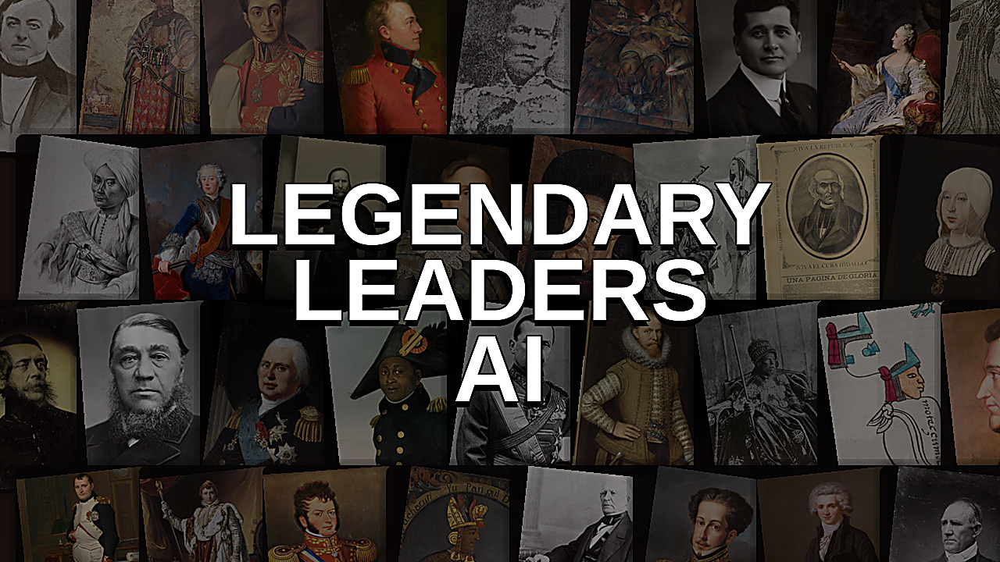

**Legendary Leaders AI** is a standalone Age of Empires III: Definitive Edition mod that combines the base civilizations with the playable revolution roster. Each nation is mapped to a themed leader personality and a clear battlefield identity.

## 🏳️ Elite Units and Surrender

Elite units are chosen case by case for each nation and never auto-surrender. Ordinary land units can surrender once they are badly damaged and no elite support is nearby, after which they are sent to the enemy prison point and can only be recovered by their original owner with an explorer.

- Elite units never auto-surrender.
- Ordinary land units can surrender at 10% health.
- A unit will not surrender if a friendly elite unit is still nearby.
- Surrendered units are routed to the enemy's main military shipment drop point, usually the first Town Center or Home City gather-point building.
- Once imprisoned, surrendered units are held there instead of fighting normally.
- Only the original owner's explorer can reclaim imprisoned units.
- In large AI attacks, regular units lead, elites follow as the second line, and the explorer stays behind them with a dedicated escort.
- If the AI explorer dies, the elite line retreats and the AI tries to ransom its leader.

## 🧭 Leader Escort and Attack Doctrine

Each AI now treats its explorer as the battlefield leader instead of a disposable scout. The army tries to keep a living screen around that leader, and different nations decide battles in different ways.

- Defensive and line-focused leaders keep a thicker escort around the explorer and aim to break the enemy's main army first.
- Aggressive and cavalry-heavy leaders will still protect their explorer, but they are more willing to lunge for an exposed enemy explorer if that leader is actually fighting near the front.
- The AI does not blindly chase explorers hiding at home. Decapitation strikes only happen when the enemy leader is close enough to the real battle to matter.
- If the explorer is lost, the elite core disengages instead of suiciding, then the AI attempts to ransom the leader back into play.

In short: some nations win by crushing the line, others look for a leader-kill opening, but all of them now guard their own leader far more carefully.

## 🌍 Nation Guide

Portraits below match the current in-game nation portraits used by the mod. The flag column now uses compact period flags where a clear historical state flag exists, and the closest documented banner or emblem for Indigenous confederacies and short-lived movements that did not use a standardized national flag. The Elite Units column lists the units treated as elite. The Non-Elite Units column lists the representative ordinary land cores that can surrender; it is descriptive rather than an exhaustive dump of every shipment-only, native, or mercenary exception.

<strong>Standard Nations (22)</strong>

| Portrait | Flag | Nation | Leader | Elite Units | Non-Elite Units | Playstyle |
| --- | --- | --- | --- | --- | --- | --- |
| 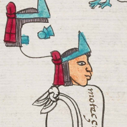 | 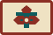 | Aztecs | Montezuma II | Jaguar Knight, Arrow Knight | Macehualtin, Coyote Runner, Puma Spearman, Eagle Runner, Skull Knight. | *Aggressive* imperial warbands with fast infantry pressure and coyote mobility. |
| 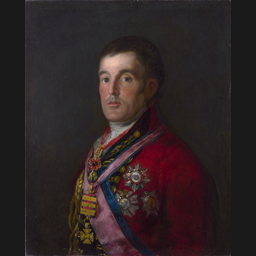 |  | British | Duke of Wellington | Musketeer | Longbowman, Hussar, Dragoon, Grenadier, Ranger, artillery. | *Defensive* manor-and-musketeer play with reliable artillery scaling. |
| 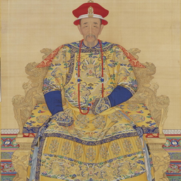 |  | Chinese | Kangxi Emperor | Arquebusier, Meteor Hammer | Chu Ko Nu, Changdao, Keshik, Steppe Rider, Iron Flail, Flying Crow. | *Balanced* banner-army macro with layered armies and steady siege support. |
| 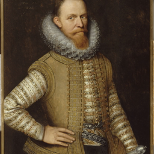 |  | Dutch | Maurice of Nassau | Halberdier, Ruyter | Pikeman, Skirmisher, Musketeer, Hussar, Grenadier, artillery. | *Defensive* bank economy with skirmisher-ruyter control. |
| 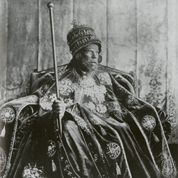 |  | Ethiopians | Menelik II | Oromo Warrior, Shotel Warrior | Gascenya, Neftenya, Javelin Rider, mortar crews, support infantry. | *Aggressive* modernization with strong infantry pressure and artillery follow-through. |
| 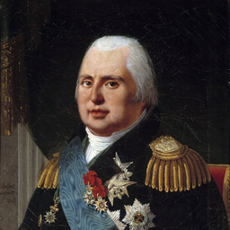 |  | French | Louis XVIII | Skirmisher, Cuirassier | Musketeer, Hussar, Dragoon, Grenadier, artillery. | *Defensive* Bourbon restoration with cavalry reserves, trade emphasis, and fort-backed control. |
| 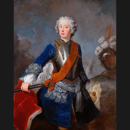 |  | Germans | Frederick the Great | Skirmisher, Uhlan | Doppelsoldner, War Wagon, Hussar, Crossbowman, artillery. | *Balanced* cavalry-mercenary warfare with strong timing pushes. |
| 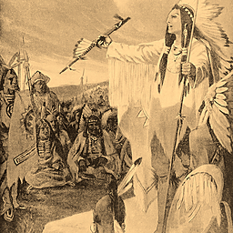 |  | Haudenosaunee | Hiawatha | Tomahawk, War Rifle | Aenna, Mantlet, Forest Prowler, Musket Rider, light cannon. | *Balanced* confederacy warfare with early warband mass and siege pressure. |
| 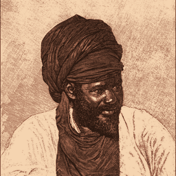 |  | Hausa | Usman dan Fodio | Fula Warrior, Raider | Maigadi, Lifidi Knight, Desert Archer, cannon and mortar crews. | *Aggressive* influence-backed expansion with mobile raids. |
| 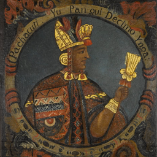 |  | Inca | Pachacuti | Bolas Warrior, Jungle Bowman | Huaraca, Chimu Runner, Maceman, spearmen, support infantry. | *Defensive* mountain empire with dense infantry and attritional control. |
| 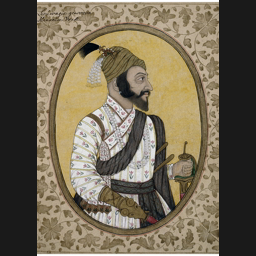 |  | Indians | Shivaji Maharaj | Sepoy, Sowar | Gurkha, Rajput, Zamburak, Howdah, Mahout, Urumi. | *Balanced* flexibility with strong infantry cores and sharp transitions. |
| 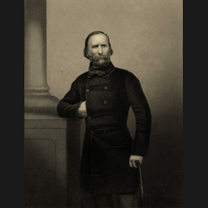 |  | Italians | Giuseppe Garibaldi | Bersagliere, Pavisier | Schiavone, Papal Zouave, mounted infantry, militia, artillery. | *Balanced* architect-command economy with flexible infantry-artillery play. |
| 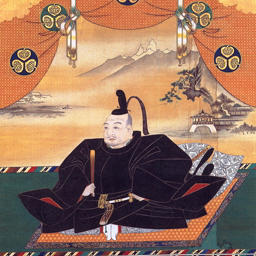 |  | Japanese | Tokugawa Ieyasu | Kensei, Ashigaru | Yumi, Samurai, Yabusame, Naginata Rider, Flaming Arrow. | *Defensive* shrine economy with disciplined timing windows. |
| 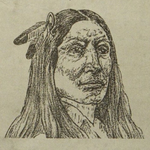 |  | Lakota | Crazy Horse | Axe Rider, Rifle Rider | Bow Rider, Wakina Rifle, Tashunke Prowler, Club Warrior. | *Aggressive* mounted mobility with constant raiding and map control. |
| 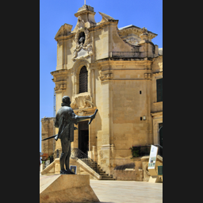 |  | Maltese | Jean Parisot de Valette | Hospitaller, Hoop Thrower | Crossbowman, Pikeman, Fire Thrower, Sentinel, artillery. | *Defensive* fortress play with emplacements and stubborn infantry anchors. |
| 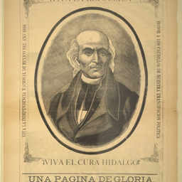 |  | Mexicans | Miguel Hidalgo y Costilla | Soldado, Chinaco | Insurgente, Salteador, Cuatrero, Lancero, artillery. | *Balanced* insurgent republic with adaptable armies and civic tempo. |
| 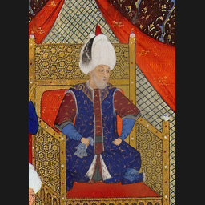 |  | Ottomans | Suleiman the Magnificent | Grenadier, Hussar | Janissary, Abus Gun, Nizam Fusilier, Spahi, artillery. | *Aggressive* gunpowder tempo with Janissary pressure and artillery spikes. |
| 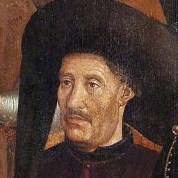 |  | Portuguese | Prince Henry the Navigator | Musketeer, Dragoon | Cassador, Hussar, Organ Gun, Pikeman, Crossbowman, artillery. | *Defensive* town-center boom with strong ranged cores. |
| 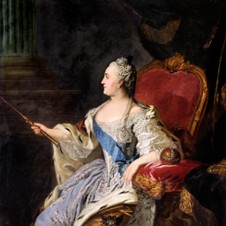 |  | Russians | Catherine the Great | Grenadier, Cavalry Archer | Streltsy, Cossack, Oprichnik, Musketeer, artillery. | *Aggressive* mass-army play with cheap infantry floods and blockhouse pressure. |
| 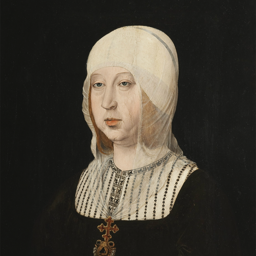 |  | Spanish | Isabella I of Castile | Rodelero, Lancer | Pikeman, Crossbowman, Musketeer, Dragoon, Hussar, artillery. | *Aggressive* shipment-led conquest with fast timing attacks. |
| 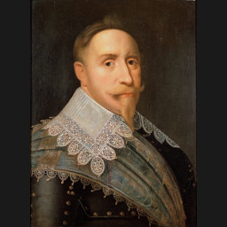 |  | Swedes | Gustavus Adolphus | Pikeman, Finnish Rider | Carolean, Hakkapelit, Leather Cannon, Hussar, artillery. | *Aggressive* torp-and-timing warfare with Carolean mass. |
|  |  | United States | George Washington | Rifleman, US Cavalry | Regular, State Militia, Sharpshooter, Carbine Cavalry, artillery. | *Balanced* republican flexibility with broad card options and steady scaling. |

<strong>Revolution Nations (26)</strong>

| Portrait | Flag | Nation | Leader | Elite Units | Non-Elite Units | Playstyle |
| --- | --- | --- | --- | --- | --- | --- |
| 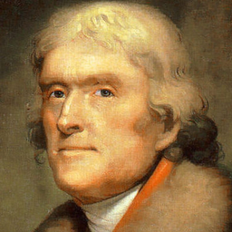 |  | Americans | Thomas Jefferson | Gatling Gun, Congreve Rocket | Regulars, State Militia, Sharpshooters, volunteer cavalry, field guns. | *Balanced* statesman-general play with flexible infantry and measured artillery scaling. |
| 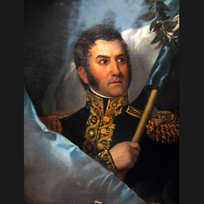 |  | Argentines | Jose de San Martin | Pikeman, Rodelero, Lancer | Musketeers, dragoons, grenadiers, militia, field guns. | *Aggressive* liberation cavalry with fast campaigning and mobile strikes. |
| 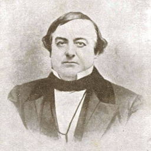 |  | Baja Californians | Juan Bautista Alvarado | Chinaco, Salteador | Insurgentes, Soldados, Cuatreros, militia, field guns. | *Aggressive* frontier raiding with cavalry-heavy harassment. |
| 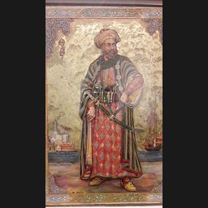 |  | Barbary | Hayreddin Barbarossa | Barbary Warrior, Tribal Horseman, Bedouin Horse Archer | Corsair infantry, camel riders, gunpowder troops, field guns. | *Aggressive* corsair warfare with trade disruption and raids. |
| 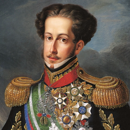 |  | Brazil | Pedro I of Brazil | Musketeer, Dragoon, Crossbowman, Pikeman | Cassadors, Hussars, Organ Guns, militia, heavy cannons. | *Balanced* imperial combined arms with reliable artillery support. |
| 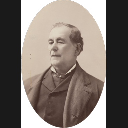 |  | Californians | Mariano Guadalupe Vallejo | Chinaco, Salteador | Insurgentes, Soldados, Cuatreros, militia, field guns. | *Defensive* frontier administration with trade-rich economy and careful cavalry response. |
| 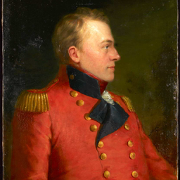 |  | Canadians | Isaac Brock | Musketeer, Hussar | Longbowmen, Rangers, Dragoons, Grenadiers, field guns. | *Defensive* frontier line with forts and disciplined infantry-artillery play. |
| 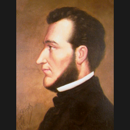 |  | Central Americans | Francisco Morazan | Chinaco, Salteador | Insurgentes, Soldados, Cuatreros, militia, field guns. | *Balanced* federalist warfare with native alliances and steady tempo. |
| 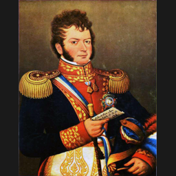 |  | Chileans | Bernardo O'Higgins | Pikeman, Rodelero, Lancer, Hussar | Musketeers, Dragoons, Grenadiers, militia, field guns. | *Balanced* republican army with disciplined infantry and fort support. |
| 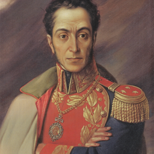 |  | Columbians | Simon Bolivar | Pikeman, Rodelero, Lancer | Musketeers, Dragoons, Grenadiers, militia, field guns. | *Aggressive* liberator combined arms with forward bases and artillery pressure. |
| 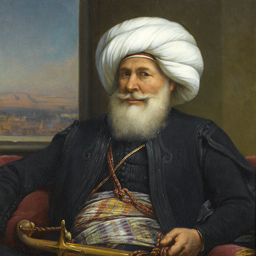 |  | Egyptians | Muhammad Ali Pasha | Deli, Humbaraci | Janissaries, Abus Guns, Nizam Fusiliers, Spahi, artillery. | *Balanced* reformer modernization with strong artillery and infrastructure. |
| 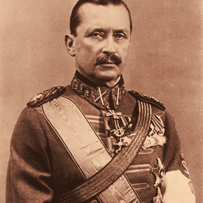 |  | Finnish | Carl Gustaf Emil Mannerheim | Pikeman, Finnish Rider, Grenadier | Caroleans, Hakkapelit, Leather Cannons, Hussars, militia. | *Defensive* marshal doctrine with entrenched infantry-artillery play. |
| 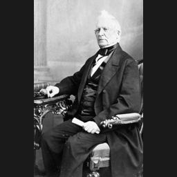 |  | French Canadians | Louis-Joseph Papineau | Skirmisher, Cuirassier | Musketeers, Hussars, Dragoons, Grenadiers, artillery. | *Defensive* militia-reformer style with civic endurance and trade resilience. |
| 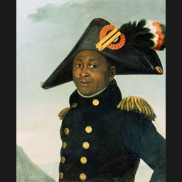 |  | Haitians | Toussaint Louverture | Maroon | Revolutionaries, Colonial Militia, dragoons, field guns. | *Aggressive* revolutionary infantry with native-backed land pressure. |
| 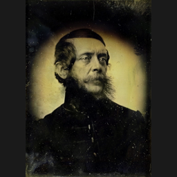 |  | Hungarians | Lajos Kossuth | Hussar | Grensers, line infantry, uhlans, militia, field guns. | *Aggressive* nationalist combined arms with strong cavalry commitment. |
| 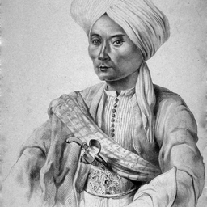 |  | Indonesians | Prince Diponegoro | Halberdier, Ruyter | Skirmishers, Musketeers, Hussars, militia, field guns. | *Defensive* resistance warfare with patient trade-backed play. |
| 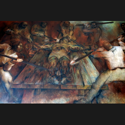 |  | Mayans | Jacinto Canek | Salteador | Insurgentes, Soldados, Cuatreros, militia, field guns. | *Aggressive* indigenous uprising with infantry and native swarms. |
| 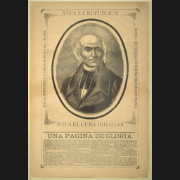 |  | Mexicans (Revolution) | Miguel Hidalgo y Costilla | Pikeman, Rodelero, Chinaco | Insurgentes, Soldados, Salteadores, militia, field guns. | *Aggressive* insurgent offense with infantry-led attacks and rising momentum. |
| 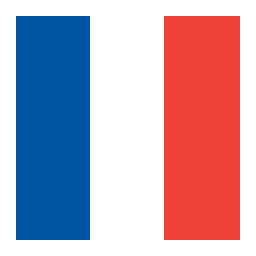 |  | Revolutionary France | Maximilien Robespierre | Skirmisher, Cuirassier | Musketeers, Hussars, Dragoons, Grenadiers, artillery. | *Aggressive* republican terror-state play with zeal, militia pressure, and anti-elite momentum. |
|  |  | Napoleonic France | Napoleon Bonaparte | Skirmisher, Cuirassier | Musketeers, Hussars, Dragoons, Grenadiers, artillery. | *Aggressive* imperial tempo with heavy artillery, cavalry support, and forward-base escalation. |
| 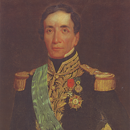 |  | Peruvians | Andres de Santa Cruz | Pikeman, Rodelero, Lancer | Musketeers, Dragoons, Grenadiers, militia, field guns. | *Defensive* Andean marshal play with infantry lines and fort-backed control. |
| 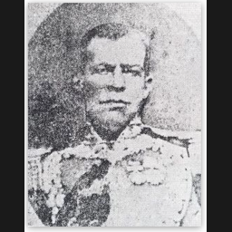 |  | Rio Grande | Antonio Canales Rosillo | Chinaco, Salteador | Insurgentes, Soldados, Cuatreros, militia, field guns. | *Aggressive* border-war mobility with fast cavalry raids. |
| 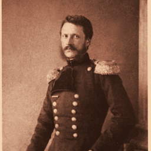 |  | Romanians | Alexandru Ioan Cuza | Dorabant, Rosior Dragoon | Line infantry, Hussars, Skirmishers, militia, field guns. | *Defensive* reformist combined arms with organized infantry-artillery pressure. |
| 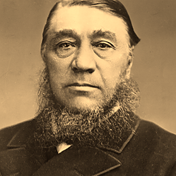 |  | South Africans | Paul Kruger | Halberdier, Ruyter | Skirmishers, Musketeers, Hussars, militia, field guns. | *Defensive* frontier command with trade leverage and stubborn strongpoints. |
| 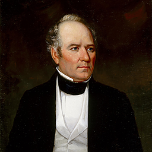 |  | Texians | Sam Houston | Chinaco, State Militia | Riflemen, Volunteers, Dragoons, militia, field guns. | *Defensive* frontier counterpunch with fortified positions. |
| 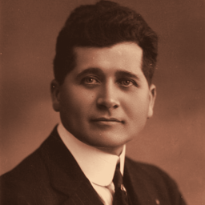 |  | Yucatan | Felipe Carrillo Puerto | Chinaco, Salteador | Insurgentes, Soldados, Cuatreros, militia, field guns. | *Balanced* regional resistance with native support and stubborn territorial play. |

